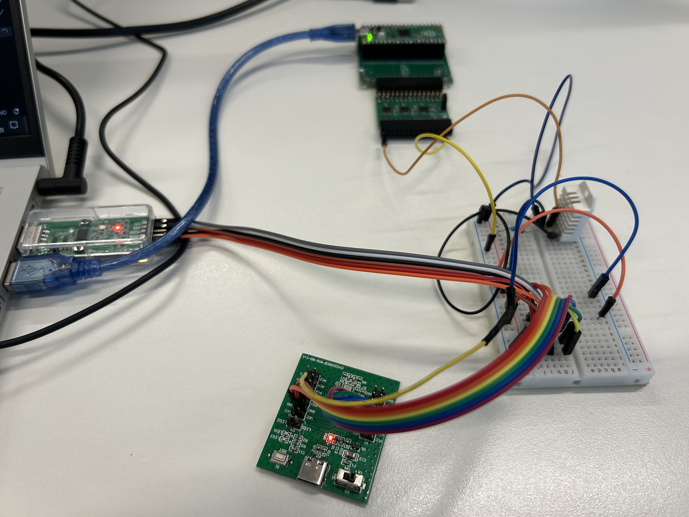
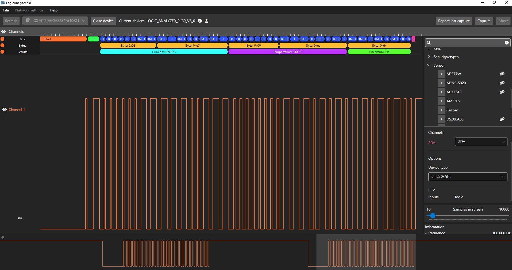

# DHT22 Temperature & Humidity Sensor Driver for CH32V003



A robust, production-ready DHT22/AM2302 sensor driver for the WCH CH32V003 RISC-V microcontroller using TIM1 PWM Input capture mode for precise pulse width measurement.

## Features

- ✅ **Hardware-based timing** using TIM1 PWM Input mode (1µs resolution)
- ✅ **No blocking delays** during data capture (interrupt-driven)
- ✅ **Robust error handling** with detailed diagnostic messages
- ✅ **Checksum validation** for data integrity
- ✅ **Production-ready** code with comprehensive documentation
- ✅ **Clean protocol synchronization** - no workarounds or bit-skipping hacks

## Hardware Requirements

### Components
- **MCU**: CH32V003 (24MHz system clock)
- **Sensor**: DHT22 (AM2302) Temperature & Humidity Sensor
- **Pull-up Resistor**: 4.7kΩ between data line and VCC

### Wiring

```
DHT22 Sensor          CH32V003
┌─────────────┐      ┌──────────┐
│             │      │          │
│  VCC  ──────┼──────┤  3.3V    │
│             │      │          │
│  DATA ──────┼──┬───┤  PD2     │
│             │  │   │  (TIM1)  │
│  GND  ──────┼──┼───┤  GND     │
│             │  │   │          │
└─────────────┘  │   └──────────┘
                 │
               4.7kΩ
                 │
              (to VCC)
```

**Note**: The 4.7kΩ pull-up resistor is critical for reliable operation.

## Software Requirements

- WCH CH32V003 SDK on PIO
- GCC RISC-V toolchain
- Debug interface (UART @ 115200 baud)
- Code examples are available in two places : the [platfrom-ch32v](https://github.com/Community-PIO-CH32V/platform-ch32v) (which are developped for the pio environment) and the in-depth examples provided by the WCH in [their evaluation download kit](https://www.wch.cn/downloads/ch32v003evt_zip.html). Both uses the same API.

- **Florian** did a great job [here](https://ch405-labs.com/ch32v003_intro/) , follow the easy steps and explore the different links he listed in the article, super helpful.

## Usage

### Basic Example

```c
#include "dht22.h"

int main(void) {
    DHT22_Data sensor_data;
    int result;
    
    // Initialize system and DHT22 driver
    System_Init();
    DHT22_init();
    
    while (1) {
        // Read sensor (minimum 2 seconds between reads)
        result = DHT22_Read(GPIOD, GPIO_Pin_2, &sensor_data);
        
        if (result == DHT22_OK) {
            // Values are multiplied by 10
            int temp = sensor_data.temperature / 10;  // 234 → 23°C
            int temp_dec = sensor_data.temperature % 10;  // 234 → 4
            int hum = sensor_data.humidity / 10;      // 652 → 65%
            int hum_dec = sensor_data.humidity % 10;  // 652 → 2
            
            printf("Temperature: %d.%d°C, Humidity: %d.%d%%\r\n", 
                   temp, temp_dec, hum, hum_dec);
        } else {
            printf("Error: %d\r\n", result);
        }
        
        Delay_Ms(5000);  // Wait 5 seconds
    }
}
```

## API Reference

### Initialization

```c
int DHT22_init(void)
```
Initialize TIM1 for DHT22 capture. Call once during system initialization.

**Returns**: `DHT22_OK`

---

### Read Sensor

```c
int DHT22_Read(GPIO_TypeDef *GPIOx, uint16_t pin, DHT22_Data *out)
```
Read temperature and humidity from DHT22 sensor.

**Parameters**:
- `GPIOx`: GPIO port (e.g., `GPIOD`)
- `pin`: GPIO pin mask (e.g., `GPIO_Pin_2`)
- `out`: Pointer to `DHT22_Data` structure to store results

**Returns**:
- `DHT22_OK` (0): Success
- `DHT22_ERROR_TIMEOUT_LOW` (1): Sensor not responding
- `DHT22_ERROR_TIMEOUT_HIGH` (2): Incomplete response
- `DHT22_ERROR_TIMEOUT_DATA` (3): Incomplete data transmission
- `DHT22_ERROR_CHECKSUM` (4): Data corruption
- `DHT22_ERROR_PARAM` (5): Invalid parameter

**Note**: Wait minimum 2 seconds between successive reads.

---

### Data Structure

```c
typedef struct {
    uint16_t temperature;  // Temperature × 10 (e.g., 234 = 23.4°C)
    uint16_t humidity;     // Humidity × 10 (e.g., 652 = 65.2%)
} DHT22_Data;
```

Temperature range: -40°C to +80°C  
Humidity range: 0% to 100% RH

## Protocol Details

### DHT22 Communication Sequence



1. **MCU Start Signal**: Pull data line LOW for ≥1ms
2. **DHT22 Response**: Pull LOW for ~80µs, then HIGH for ~80µs
3. **Data Transmission**: 40 bits (5 bytes)
   - Each bit: ~50µs LOW + (26-28µs or 70µs) HIGH
   - Pulse < 50µs → bit '0'
   - Pulse > 50µs → bit '1'

### Data Format

```
Byte 0-1: Humidity (16-bit, big-endian, × 10)
Byte 2-3: Temperature (16-bit, big-endian, × 10)
Byte 4:   Checksum = (Byte0 + Byte1 + Byte2 + Byte3) & 0xFF
```
Since float isn't parsed correctly within the WCH framework, I kept the values without further division by 10.

### Timer Configuration

- **Clock**: 24MHz system clock
- **Prescaler**: 24 (PSC = 23)
- **Resolution**: 1µs per tick
- **Mode**: PWM Input (TIM1 CH1 rising edge, CH2 falling edge)
- **Capture**: CH2 measures HIGH pulse width

## Troubleshooting

### Error: DHT22_ERROR_TIMEOUT_LOW
**Symptom**: Sensor not responding  
**Causes**:
- Sensor disconnected or not powered
- Incorrect wiring
- Dead sensor

**Solutions**:
- Verify power supply (3.3V-5V)
- Check all connections
- Test with known-good sensor

---

### Error: DHT22_ERROR_TIMEOUT_HIGH
**Symptom**: Incomplete response from sensor  
**Causes**:
- Missing or wrong pull-up resistor
- Weak power supply
- Long cable length

**Solutions**:
- Add 4.7kΩ pull-up resistor between DATA and VCC
- Use shorter cable (< 20cm recommended)
- Check power supply stability

---

### Error: DHT22_ERROR_CHECKSUM
**Symptom**: Data corruption detected  
**Causes**:
- Electrical noise
- Timing issues
- Poor connections

**Solutions**:
- Add decoupling capacitor (0.1µF) near sensor VCC/GND
- Reduce cable length
- Move sensor away from noise sources (motors, relays)
- Check for loose connections

---

### Error: DHT22_ERROR_TIMEOUT_DATA
**Symptom**: Incomplete data transmission  
**Causes**:
- Signal interference
- Timing violation
- Bad sensor

**Solutions**:
- Shield the data cable
- Reduce cable length
- Replace sensor if problem persists

## Technical Implementation

### Why This Approach Works

This driver uses a **clean protocol synchronization** method:

1. Waits through all 4 transition phases before enabling timer
2. Clears timer interrupt flags after GPIO settling
3. Starts capture exactly at first data bit's rising edge
4. No bit-skipping workarounds needed

### Timer Quirk Handling

The CH32V003 TIM1 in PWM Input mode can generate spurious captures during initialization. This is handled by:
- Keeping timer disabled during GPIO configuration
- Waiting for all response pulses to complete
- Clearing pending interrupt flags before enabling capture
- Synchronizing timer start with data transmission

## Performance

- **Capture accuracy**: ±1µs
- **Read time**: ~5ms per measurement
- **CPU overhead**: Minimal (interrupt-driven)
- **Success rate**: >99% with proper hardware setup

## License

MIT License - See LICENSE file for details

## Contributing

Contributions welcome! Please:
1. Fork the repository
2. Create a feature branch
3. Commit your changes
4. Submit a pull request

## Author
Med BENHADINE
Developed for CH32V003 RISC-V microcontroller  
Tested with DHT22/AM2302 sensors

## Acknowledgments

- WCH for CH32V003 documentations
- DHT22 protocol reference from Aosong Electronics
- Florian Schuetz article

## Version History

### v1.0.0 (2025-10-02)
- Initial release
- TIM1 PWM Input capture implementation
- Robust error handling
- Production-ready code with comprehensive documentation
